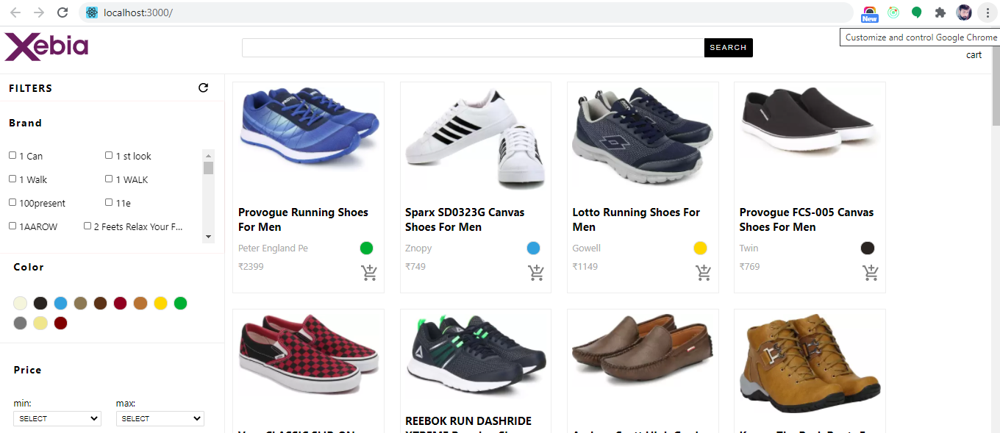
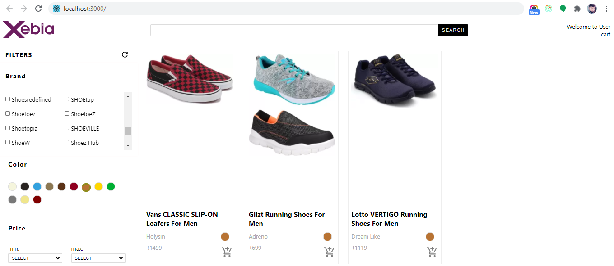

<b>##########</b>

<h2>STEP-1 npm install</h2>

<<b>##########</b>

if error given 
There might be a problem with the project dependency tree.
It is likely not a bug in Create React App, but something you need to fix locally.

The react-scripts package provided by Create React App requires a dependency:

  "babel-eslint": "10.1.0"

Don't try to install it manually: your package manager does it automatically.
However, a different version of babel-eslint was detected higher up in the tree:

  C:\Users\hp\Downloads\node_modules\babel-eslint (version: 7.2.3)

Manually installing incompatible versions is known to cause hard-to-debug issues.

####################

create .env file 

and paste this one 

SKIP_PREFLIGHT_CHECK=true

##########
STEP-1 npm start
##########

:) 

ScreenShot

getting all raw Data 

getting filter data 

<h2>Pending</h2>

Login functionality

Cart functionality

Code review and removal of redundant component code.

Enabling 'flow' on individual files

Search functionality

UI (hover states), loading indications.

Test
$ npm test
Debug Test
$ npm run test:debug
Coverage
$ npm test -- --coverage
Analyzing the Bundle Size
$ npm run build
$ npm run analyze
Check type error
$ npm run flow

Server API
API to use

GET Product Listing: https://xebiascart.herokuapp.com/products

Product Search by name: https://xebiascart.herokuapp.com/products?title=provogue

GET Product Filters: https://xebiascart.herokuapp.com/filters

User Login: https://xebiascart.herokuapp.com/users?username=amigo
